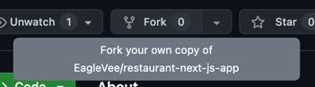

# Restaurant App

---

## Overview

Seoul Comix Restaurant App assignment

This Restaurant App is a modern web application built using Next.js, tRPC, Prisma, and PostgreSQL.

## Key Features

-   **Browse Restaurants**: Users can view a list of restaurants along with details such as ratings, descriptions, and images.
-   **Favorites**: Users can mark restaurants as favorites.
-   **Dynamic Search**: Search for restaurants by categories and name.

## Technologies

-   **Next.js**: The React framework for production.
-   **tRPC**: End-to-end typesafe APIs.
-   **Prisma**: ORM for Node.js and TypeScript.
-   **PostgreSQL**: Robust, open-source relational database.
-   **Vercel**: Platform for frontend frameworks and static sites, optimized for Next.js.

## Demo

[Vercel App Demo](https://restaurant-app-tau-two.vercel.app/)

[Demo Video](https://youtu.be/X3E_bSNkiUc)

## Local Development

### Prerequisites

-   Node.js (v16 or newer)
-   PostgreSQL database
-   A `.env` file in your project root with the necessary environment variables

### Environment Setup

1. **Clone the repository**

    ```bash
    git clone https://github.com/EagleVee/restaurant-next-js-app.git
    cd restaurant-next-js-app
    ```

2. **Install dependencies**

    ```bash
    yarn install
    ```

3. **Set up your PostgreSQL database**

    Ensure you have PostgreSQL installed and running. Create a new database for the app.

4. **Configure your environment variables**

    Create a `.env` file in the root of your project and add the following variable:

    ```plaintext
    POSTGRES_URL="postgresql://<user>:<password>@<hostname>:<port>/<dbname>"
    ```

    Replace `<user>`, `<password>`, `<hostname>`, `<port>`, and `<dbname>` with your PostgreSQL details.

5. **Run Prisma migrations**

    ```bash
    yarn prisma:init
    yarn seed
    ```

6. **Start the development server**

    ```bash
    yarn dev
    ```

    Visit `http://localhost:3000` to view the app.

## Deployment on Vercel

1. **Fork this repository onto your GitHub repository**

    

2. **Clone your git repository**

    ```bash
    git clone https://github.com/<your-name>/restaurant-next-js-app.git
    cd restaurant-next-js-app
    ```

3. **Set up Vercel**

    - Go to [Vercel](https://vercel.com) and sign in.
    - Click on "Add New..." -> "Project", select your Git repository and click Import.
    - Install Vercel CLI on your local machine: `yarn global add vercel`
    - Run `vercel` to link your local repository with your project on Vercel
    - Follow [Vercel PostgreSQL Guide](https://vercel.com/docs/storage/vercel-postgres/quickstart#create-a-postgres-database) to create a PostgreSQL database linked to your project
    - Run these commands to create your database on Vercel

    ```bash
    # Pull vercel env to local
    vercel env pull .env
    # Generate and migrate Prisma if needed
    yarn prisma:init
    # Seed your database
    yarn seed
    ```

    - Run `vercel` again to deploy with linked PostgreSQL database
    - Visit the URL generated in the terminal to view your app, or go to Vercel Dashboard to get the fixed production URL.

4. **Deploy**

    Vercel will automatically deploy your app on push to `main` branch. Watch the deployment under the "Deployments" tab.

## Accessing Environment Variables

If you are a developer looking to set up this project locally and need access to the pre-configured environment variables without access to the Vercel project:

-   Request the `POSTGRES_URL` from the project maintainer, or refer to any shared secure location where the project's environment variables are documented.
-   Alternatively, you can use `vercel env pull` to download the environment variables if you have access to the Vercel project.
